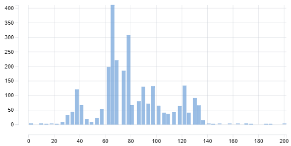

# 3. Statistical Analysis and Distribution Functions

## 3.1 Arithmetic Mean or Average

Let's take a look at the average of the ```median_value``` column.

```sql
SELECT
  AVG(measure_value)
FROM health.user_logs;
```

*Output:*

| avg                   |
|-----------------------|
| 1986.2288605267024675 |


Whoa! That's a huge number. Let's go further into this. Let's see our measures again.

```sql
SELECT
  measure,
  COUNT(*) AS counts
FROM health.user_logs
GROUP BY measure;
```

*Output:*

| measure        | counts |
|----------------|--------|
| blood_glucose  | 38692  |
| blood_pressure | 2417   |
| weight         | 2782   |

Also, let's see the average measure_value based grouped by the measure column.

```sql
SELECT
  measure,
  AVG(measure_value),
  COUNT(*) AS counts
FROM health.user_logs
GROUP BY measure
ORDER BY counts;
```

*Output:*

| measure        | avg                  | counts |
|----------------|----------------------|--------|
| blood_pressure | 95.4040815126905254  | 2417   |
| weight         | 28786.846657295953   | 2782   |
| blood_glucose  | 177.3485953624517730 | 38692  |

Something is wrong here. The weight average of a person is ```28786```. Let's comeback later to this.

## 3.2 Median & Mode

Let's also calculate the median & mode for the weight column and see why is this happening.

```sql
SELECT
  AVG(measure_value) as mean,
  PERCENTILE_CONT(0.5) WITHIN GROUP (ORDER BY measure_value) AS median,
  MODE() WITHIN GROUP (ORDER BY measure_value) AS mode
FROM health.user_logs
WHERE measure = 'weight';
```

*Output:*

| mean               | median       | mode        |
|--------------------|--------------|-------------|
| 28786.846657295953 | 75.976721975 | 68.49244787 |

Looks like there are outliers in the dataset within the measure_value column when ```measure='weights'```.

## 3.3 Spread of the Data

Let's see how the data is spread across the measure_value column and the measure is equal to weight. 

### 3.3.1 Min, Max, Range values

```sql
WITH min_max_values AS (
  SELECT
    MIN(measure_value) AS min_value,
    MAX(measure_value) AS max_value
  FROM health.user_logs
  WHERE measure = 'weight'
)

SELECT
  min_value,
  max_value,
  max_value - min_value AS range_value
FROM min_max_values;
```

*Output:*

| min_value | max_value | range_value |
|-----------|-----------|-------------|
| 0         | 39642120  | 39642120    |

### 3.3.2 Variance & Standard Deviation

The variance and standard deviation will give us a more clear idea about the spread of data as compared to just min, max values.

```sql
SELECT
  VARIANCE(measure_value) AS var_value,
  STDDEV(measure_value) AS std_value
FROM health.user_logs
WHERE measure = 'weight';
```

*Output:*

| var_value                        | std_value                  |
|----------------------------------|----------------------------|
| 1129457862383.414293789530531301 | 1062759.550596189323085400 |

## 3.4 Statistical Summary

Let's query all the stats values again but this time let's round of the data by 2 decimals.

```sql
SELECT
  'weight' as measure,
  ROUND(MIN(measure_value), 2) AS min_value,
  ROUND(MAX(measure_value), 2) AS max_value,
  ROUND(AVG(measure_value), 2) AS mean_value,
  ROUND(
    CAST(PERCENTILE_CONT(0.5) WITHIN GROUP (ORDER BY measure_value) AS NUMERIC),
    2
  ) AS median_value,
  ROUND(
    MODE() WITHIN GROUP (ORDER BY measure_value),
    2
  ) AS mode_value,
  ROUND(VARIANCE(measure_value), 2) AS var_value,
  ROUND(STDDEV(measure_value), 2) AS std_value
FROM health.user_logs
WHERE measure = 'weight';
```

*Output:*

| measure | min_value | max_value   | mean_value | median_value | mode_value | var_value        | std_value  |
|---------|-----------|-------------|------------|--------------|------------|------------------|------------|
| weight  | 0.00      | 39642120.00 | 28786.85   | 75.98        | 68.49      | 1129457862383.41 | 1062759.55 |

## 3.5 Cumulative Distribution Function

CDF takes up a value and returns the percentile in which the value belongs to. Let's query the CDF of all values in measure_value when ```measure='weight```. We'll limit the output to 10 rows.

```sql
SELECT
  measure_value,
  NTILE(100) OVER (ORDER BY measure_value) AS percentile
FROM health.user_logs
WHERE measure = 'weight'
ORDER BY percentile
LIMIT 10;
```

*Output:*

| measure_value | percentile |
|---------------|------------|
| 0             | 1          |
| 1.814368      | 1          |
| 2.26796       | 1          |
| 2.26796       | 1          |
| 8             | 1          |
| 10.432616     | 1          |
| 11.3398       | 1          |
| 12.700576     | 1          |
| 15.422128     | 1          |
| 0             | 1          |

Now, we can find out the floor and ceiling value (i.e. max and min value) within each bucket or percentile and also the total number of values present in that particular bucket. Ideally, since we are calculating 100 buckets each bucket should contain 1% of the total data.

```sql
WITH percentile_values AS (
  SELECT
    measure_value,
    NTILE(100) OVER (ORDER BY measure_value) AS percentile
  FROM health.user_logs
  WHERE measure = 'weight'
  ORDER BY percentile
)

SELECT
  percentile,
  MIN(measure_value) AS floor_value,
  MAX(measure_value) AS ceiling_value,
  COUNT(*) AS percentile_count
FROM percentile_values
GROUP BY percentile
ORDER BY percentile;
```

*Output:*

| percentile | floor_value   | ceiling_value | percentile_count |
|------------|---------------|---------------|------------------|
| 1          | 0             | 29.029888     | 28               |
| 2          | 29.48348      | 32.0689544    | 28               |
| 3          | 32.205032     | 35.380177     | 28               |
| 4          | 35.380177     | 36.74095      | 28               |
| 5          | 36.74095      | 37.194546     | 28               |
| ...        |  ...          |   ...         |    ...           |
| 95         | 129.86485     | 130.542007446 | 27               |
| 96         | 130.54207     | 131.570999146 | 27               |
| 97         | 131.670013428 | 132.776       | 27               |
| 98         | 132.776000977 | 133.832000732 | 27               |
| 99         | 133.89095     | 136.531192    | 27               |
| 100        | 136.531192    | 39642120      | 27               |

If we look at the above output. Let's just take a look at 1st and 100th percentile.

| percentile | floor_value   | ceiling_value | percentile_count |
|------------|---------------|---------------|------------------|
| 1          | 0             | 29.029888     | 28               |
| 100        | 136.531192    | 39642120      | 27               |

The ceiling_value of 1st percentile is 29.02 i.e. 29kg maybe, and the floor_value of 100th percentile is 136kg but ceiling is 3964210 kg?? Sounds abnormal. Maybe there was an incorrect measurement input fro few of the patient logs from the 100th %tile. Let's dive further into the 100th %tile to investigate more on this.

```sql
WITH percentile_values AS (
  SELECT 
    measure_value,
    NTILE(100) OVER (
      ORDER BY measure_value
    ) AS percentile
  FROM health.user_logs
  WHERE measure='weight'
)

SELECT 
  measure_value,
  ROW_NUMBER() OVER (ORDER BY measure_value DESC) AS row_number_order,
  RANK() OVER (ORDER BY measure_value DESC) AS rank_order,
  DENSE_RANK() OVER (ORDER BY measure_value DESC) AS dense_rank_order
FROM percentile_values
WHERE percentile = 100
ORDER BY measure_value DESC
LIMIT 10;
```

*Output:*

| measure_value | row_number_order | rank_order | dense_rank_order |
|---------------|------------------|------------|------------------|
| 39642120      | 1                | 1          | 1                |
| 39642120      | 2                | 1          | 1                |
| 576484        | 3                | 3          | 2                |
| 200.487664    | 4                | 4          | 3                |
| 190.4         | 5                | 5          | 4                |
| 188.69427     | 6                | 6          | 5                |
| 186.8799      | 7                | 7          | 6                |
| 185.51913     | 8                | 8          | 7                |
| 175.086512    | 9                | 9          | 8                |
| 173.725736    | 10               | 10         | 9                |

## 3.6 Large Outliers

| measure_value | row_number_order | rank_order | dense_rank_order |
|---------------|------------------|------------|------------------|
| 39642120      | 1                | 1          | 1                |
| 39642120      | 2                | 1          | 1                |
| 576484        | 3                | 3          | 2                |
| 200.487664    | 4                | 4          | 3                |

Here, if we take a look at the top 4 values. We can see values like 39642120 kg, 39642120 kg, .., 200 kg which seems unreal for a person to have. Maybe 200 kg is fine but the others are definitely outliers and we should remove them.

## 3.7 Small Outliers

We shall also look for any outliers in the 1st %tile if there are any as they could also skew our analysis.

```sql
WITH percentile_values AS (
  SELECT 
    measure_value,
    NTILE(100) OVER (
      ORDER BY measure_value
    ) AS percentile
  FROM health.user_logs
  WHERE measure='weight'
)

SELECT 
  measure_value,
  ROW_NUMBER() OVER (ORDER BY measure_value) AS row_number_order,
  RANK() OVER (ORDER BY measure_value) AS rank_order,
  DENSE_RANK() OVER (ORDER BY measure_value) AS dense_rank_order
FROM percentile_values
WHERE percentile = 1
ORDER BY measure_value
LIMIT 10;
```

*Output:*

| measure_value | row_number_order | rank_order | dense_rank_order |
|---------------|------------------|------------|------------------|
| 0             | 1                | 1          | 1                |
| 0             | 2                | 1          | 1                |
| 1.814368      | 3                | 3          | 2                |
| 2.26796       | 4                | 4          | 3                |
| 2.26796       | 5                | 4          | 3                |
| 8             | 6                | 6          | 4                |
| 10.432616     | 7                | 7          | 5                |
| 11.3398       | 8                | 8          | 6                |
| 12.700576     | 9                | 9          | 7                |
| 15.422128     | 10               | 10         | 8                |

There are a few 0 values which also seems unreal for a person to have that measure as a weight. We shall remove that as well.

## 3.8 Removing Outlier

Here, we'll create a new temporary table and remove our outliers.

```sql
DROP TABLE IF EXISTS clean_weight_logs;
CREATE TEMP TABLE clean_weight_logs AS (
  SELECT *
  FROM health.user_logs
  WHERE measure = 'weight'
    AND measure_value > 0
    AND measure_value < 201
);
```

*Output:*

None

Now, let's run all the statistical analysis on this new temp dataset without the outliers.

```sql
SELECT
  ROUND(MIN(measure_value), 2) AS minimum_value,
  ROUND(MAX(measure_value), 2) AS maximum_value,
  ROUND(AVG(measure_value), 2) AS mean_value,
  ROUND(
    CAST(PERCENTILE_CONT(0.5) WITHIN GROUP (ORDER BY measure_value) AS NUMERIC),
    2
  ) AS median_value,
  ROUND(
    MODE() WITHIN GROUP (ORDER BY measure_value),
    2
  ) AS mode_value,
  ROUND(STDDEV(measure_value), 2) AS standard_deviation,
  ROUND(VARIANCE(measure_value), 2) AS variance_value
FROM clean_weight_logs;
```

*Output:*

| minimum_value | maximum_value | mean_value | median_value | mode_value | standard_deviation | variance_value |
|---------------|---------------|------------|--------------|------------|--------------------|----------------|
| 1.81          | 200.49        | 80.76      | 75.98        | 68.49      | 26.91              | 724.29         |

Now the stats look somewhat normal as they don't have any huge or odd values. Also, let's take a look at the Cumulative Distribution Function for our new weight dataset.

```sql
WITH percentile_values AS (
  SELECT
    measure_value,
    NTILE(100) OVER (
      ORDER BY
        measure_value
    ) AS percentile
  FROM clean_weight_logs
)
SELECT
  percentile,
  MIN(measure_value) AS floor_value,
  MAX(measure_value) AS ceiling_value,
  COUNT(*) AS percentile_counts
FROM percentile_values
GROUP BY percentile
ORDER BY percentile;
```

*Output:*

| percentile | floor_value | ceiling_value | percentile_counts |
|------------|-------------|---------------|-------------------|
| 1          | 1.814368    | 29.48348      | 28                |
| 2          | 29.48348    | 32.4771872    | 28                |
| 3          | 32.658623   | 35.380177     | 28                |
| 4          | 35.380177   | 36.74095      | 28                |
| 5          | 36.74095    | 37.194546     | 28                |
| ...        |  ...        |   ...         |    ...            |
| 95         | 129.77278   | 130.52802     | 27                |
| 96         | 130.5389    | 131.54168     | 27                |
| 97         | 131.54169   | 132.6599      | 27                |
| 98         | 132.736     | 133.765       | 27                |
| 99         | 133.80965   | 136.0776      | 27                |
| 100        | 136.0776    | 200.487664    | 27                |

## 3.9 Frequency Distribution

Let's finally also plot a histogram to see the distribution of values in a visual graph. We use the ```WIDTH_BUCKET``` function to break down into n number of buckets.

```sql
SELECT
  WIDTH_BUCKET(measure_value, 0, 200, 50) AS bucket,
  AVG(measure_value) AS measure_value,
  COUNT(*) AS frequency
FROM clean_weight_logs
GROUP BY bucket
ORDER BY bucket
LIMIT 10;
```

*Output:*

| bucket | measure_value       | frequency |
|--------|---------------------|-----------|
| 1      | 2.1167626666666667  | 3         |
| 3      | 9.9241386666666667  | 3         |
| 4      | 14.0613520000000000 | 2         |
| 5      | 18.1436800000000000 | 1         |
| 6      | 22.2260080000000000 | 2         |
| 7      | 26.6485300000000000 | 8         |
| 8      | 30.5550911625000000 | 32        |
| 9      | 34.4161344213953488 | 43        |
| 10     | 37.9527840350000000 | 120       |
| 11     | 41.5446259242424242 | 66        |

**Histogram Plot:**



Looks like there are large number of patients with weight in between 60-80 kg/lb.